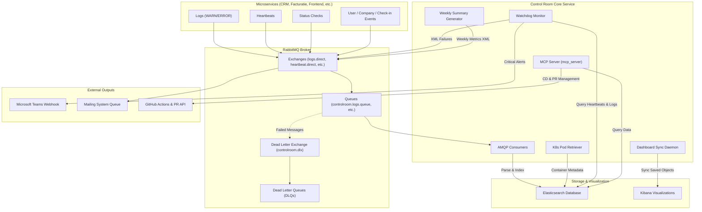

# Control Room

The **Control Room** is the central monitoring, ingestion, and diagnostic hub of the microservice architecture. It receives, validates, and stores event-driven data (heartbeats, status checks, logs, users, companies, check-ins) from multiple microservices into **Elasticsearch**, synchronizes dynamic dashboards in **Kibana**, runs automated watchdogs with alerts to **Microsoft Teams**, and exposes a diagnostic interface using the **Model Context Protocol (MCP)**.

---

## Architecture Overview

The following diagram illustrates how data flows from external microservices through the Control Room's ingestion pipeline, alerting systems, and auxiliary components.



---

## Key Features

### 1. RabbitMQ Topology & Robust Message Processing
- **Active Topology Setup**: At boot, the Control Room automatically declares exchanges, queues, and bindings defined in `internal/cr_config/consumer_config.go`.
- **Dead-Letter Safety Net (DLX/DLQ)**: A dedicated Dead-Letter Exchange (`controlroom.dlx`) and individual Dead-Letter Queues (DLQs) automatically capture messages that fail parsing or validation, preventing message loss and enabling manual reprocessing.
- **Failover & Reconnection**: Employs a resilient session loop with exponential backoff (starting at 1s, doubling up to a maximum of 60s) to automatically reconnect to RabbitMQ if the connection is interrupted.
- **End-to-End Heartbeat Testing**: Periodically publishes internal heartbeats and consumes them back to verify the integrity of the entire message broker pipeline.

### 2. Ingestors & Data Handlers
Messages consumed from RabbitMQ are parsed, validated, and indexed into Elasticsearch. The system handles the following data types:
- **Heartbeats**: Consumed from `controlroom.heartbeat.queue` and logged in `heartbeats` index to monitor service uptime.
- **Logs**: Consumed from `controlroom.logs.queue` and indexed in `controlroom-logs` to centralize microservice warnings and errors.
- **Status Checks**: Health updates indexed in `statuscheck` to keep a history of components.
- **User Registrations**: Integrates user details from CRM (`crm.user.confirmed` and `controlroom.user.confirmed`).
- **Company Registrations**: Processes company onboarding records from `crm.company.confirmed`.
- **Check-ins**: Captures attendance/event check-ins from `controlroom.user.checkin`.
- **User Acknowledgments**: Bidirectional verification logs to track user validation status across services.

### 3. Active Watchdog & Microsoft Teams Alerting
- **Service Liveness Checks**: The Watchdog periodically queries Elasticsearch log records and heartbeats to determine the state of the primary microservices (`CRM`, `FACTURATIE`, `FRONTEND`, `MAILING`, `PLANNING`, `KASSA`).
- **State Transition Alerts**:
  - If a service goes offline (heartbeat count falls below 30 in the last 60s), the Watchdog flags the status and pushes a **Critical Alarm** Adaptive Card to Microsoft Teams via a webhook.
  - When the service recovers, a **Resolution** alert is sent to Microsoft Teams.
  - Changes in service health also publish XML-encoded `HeartbeatStatusEventType` events back to RabbitMQ for downstream components.
- **Log Threshold Triggers**: Checks warnings and errors in Elasticsearch log indexes; if errors/warnings exceed the threshold of `5` in a check period, it publishes structured XML notifications.

### 4. Kubernetes Pod Retriever
- Running containerized, the Control Room executes a background loop every 5 seconds to query the local Kubernetes cluster namespace.
- It retrieves real-time pod metadata (CPU/Memory requests, limits, restart counts, ready status, node placement, IP allocations).
- This data is indexed directly into Elasticsearch, providing a reliable diagnostic footprint of the container deployment.

### 5. Kibana Dashboard Synchronization
- Automates the provisioning of Kibana Data Views and Dashboards using the Kibana Saved Objects API.
- Synchronizes visualizations defined in the template `dashboards.ndjson` file periodically, ensuring that developers always have access to up-to-date log aggregations and heartbeat monitoring views.

### 6. Model Context Protocol (MCP) Server
- Implements an HTTP-streamed **MCP Server** (`controlroom-mcp`) allowing AI assistants (like Claude, Gemini, or other agents) to query information and diagnose issues directly.
- **Exposed Diagnostic Tools**:
  - `error_analysis`: Queries error logs from Elasticsearch using Lucene strings.
  - `heartbeat_status`: Fetches recent heartbeat event details.
  - `statuscheck_summary`: Reviews recent service statuses.
  - `fetch_logs`: Fetches ERROR/WARN logs for a service centered around a timestamp window.
  - `fetch_recent_deploys` & `fetch_recent_commits`: Queries GitHub Actions workflows and commit history for specific service repositories.
  - `fetch_blob`: Reads file contents by SHA from GitHub to review bug roots.
  - `request_changes`: Automatically generates a pull request on GitHub to apply fixes.

### 7. XML Schema (XSD) Struct Generator (`xmlgen`)
- A standalone development compiler (`cmd/meta`) that simplifies external schema integration.
- Parses `.xsd` schema files placed in `pkg/xsd` and outputs ready-to-use Go struct files in `pkg/gen` matching XML formatting, JSON keys, and validation properties.
- > [!NOTE]
  > The Lexer and Abstract Syntax Tree (AST) parser in `pkg/meta/meta.go` are completely handwritten, simplifying integration to a drag-and-drop workflow.

### 8. Weekly AI & Metric Summaries
- A weekly worker queries historical metrics (like total users and companies index counts) and publishes a compiled XML summary to the `news.topic` topic exchange for distribution.

---

## Repository Structure

| Directory / File | Description |
| :--- | :--- |
| **`cmd/`** | Application Entry Points |
|  `cmd/controlroom/` | Core application entry point; initializes setup, connections, consumers, and background loops (`main.go`). |
|  `cmd/meta/` | Entry point for the `xmlgen` compiler tool; processes XSD files into Go structs. |
| **`internal/`** | Core Business Logic & Processors |
|  `internal/checkin/` | Processes check-in events and indexes them to Elasticsearch. |
|  `internal/company/` | Processes company confirmations and aggregates company index counts. |
|  `internal/cr_config/` | System configuration (RabbitMQ topology definitions, Kibana credentials, Elasticsearch endpoints). |
|  `internal/cr_github/` | Wrapper client for fetching commits, workflow runs, blobs, and raising PRs. |
|  `internal/cr_logger/` | Processes incoming microservice logs and writes queries to index logs. |
|  `internal/cr_rabbitmq/` | Core RabbitMQ wrapper managing setup, queues, DLQs, consumer loops, and publishing. |
|  `internal/dashboard_sync/` | Kibana integration logic to synchronize visual dashboards. |
|  `internal/heartbeat/` | Handles microservice heartbeat ingestion and ES queries. |
|  `internal/k8retriever/` | Kubernetes clientset wrapper for scraping local namespace container statuses. |
|  `internal/mcp_server/` | MCP server registration defining developer/AI diagnostic tools. |
|  `internal/statuscheck/` | Health check logic for tracking external dependencies and components. |
|  `internal/summary/` | Ingests data views to build and publish weekly statistics. |
|  `internal/user/` & `user_acknowledgment/` | Ingestion, validation, and acknowledgment indexing of user entities. |
|  `internal/watchdog/` | Liveness tracker checking thresholds, alerting MS Teams, and publishing alerts. |
| **`pkg/`** | Shared Libraries & Generated Code |
|  `pkg/gen/` | Output directory containing generated Go structures mapped from XSD schemas. |
|  `pkg/logger/` | Internal debug-ready logger wrapper for structured console and Elasticsearch logging. |
|  `pkg/meta/` | Handwritten Lexer and AST parser used by `xmlgen`. |
|  `pkg/xsd/` | XML Schema Definition files (input schemas designed by the team). |
| **`tests/`** | Testing Suite |
|  `tests/deployments/` | Local environment orchestration; contains the test `docker-compose.yml` and superuser credentials. |
|  `tests/integration_tests/` | E2E integration test suite for RabbitMQ publishers, consumers, and Elasticsearch components. |
|  `tests/unit/` | Unit tests for XML schemas validation, message parsers, and processor logic. |
| **Root Files** | |
| `Dockerfile` | Builds the Go production image. |
| `docker-compose.yml` | Sets up local Elasticsearch, Kibana, and Control Room runner. |
| `dashboards.ndjson` | Backup and sync representation of Kibana views. |
| `.env.example` | Template for environment variable configurations. |

---

## Stack & Dependencies

The Control Room leverages the following technologies:
- **Language**: Go 1.26
- **Messaging**: RabbitMQ (`amqp091-go`)
- **Search & Ingestion**: Elasticsearch 9 (`go-elasticsearch/v9`)
- **Dashboarding**: Kibana 9.3.1
- **Orchestration**: Kubernetes Client Go (`k8s.io/client-go`)
- **AI Diagnostics**: Model Context Protocol SDK (`github.com/mark3labs/mcp-go`)

---

## Getting Started

### 1. Build and Run via Docker Compose

In the root directory, create a `.env` file based on `.env.example` and execute:

```bash
docker compose up -d --build
```

### 2. Environment for Local / Integration Testing

To launch the test environment containing pre-configured networks, RabbitMQ, and mock instances:

```bash
cd tests/deployments
docker compose up -d --build
```

### 3. Access Points
- **RabbitMQ Dashboard**: [http://localhost:15672](http://localhost:15672)
- **Elasticsearch API**: [http://localhost:9200](http://localhost:9200)
- **Kibana Interface**: [http://localhost:5601](http://localhost:5601)

### 4. Kibana Initialization
Once Kibana is running, set up the following Data Views under **Stack Management** → **Data Views** (use `@timestamp` as the timestamp field):
- `heartbeats`
- `statuscheck`
- `users`
- `controlroom-logs`

---

## Testing

### Running the Entire Test Suite
Ensure your environment is running, then trigger:
```bash
go test ./tests/...
```

### Running Individual Integration Tests
Individual integration tests depend on shared utilities in `helper.go`. Run them by passing both files to the test command:
```bash
go test tests/integration_tests/heartbeat_test.go tests/integration_tests/helper.go
```

---

## The Team

The Control Room service was developed by:

- **Abdellah El Morabit** (Team Lead)
- **Marwan Makouh**
- **Steven Deloof**
- **Thomas Heusdens**
